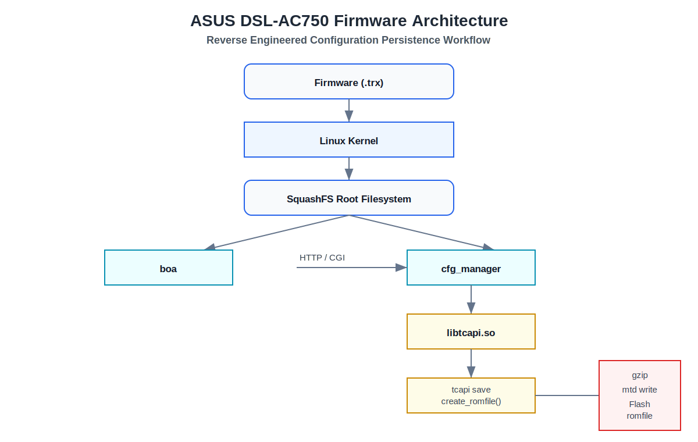

# ASUS DSL-AC750 Firmware Reverse Engineering

<p align="center">


</p>

</p>

---

## Overview

This repository documents a complete reverse engineering study of the **ASUS DSL-AC750** firmware.

The objective was to understand how the firmware boots, how services communicate, how configuration values are stored, and how the persistent ROMFILE database is written into flash memory.

Unlike a simple firmware extraction project, this repository follows the complete configuration lifecycle—from HTTP requests generated by the web interface to the final flash write operation performed by the firmware.

---

## Firmware Architecture

<p align="center">



</p>

---

## Repository Structure

```
.
├── diagrams/
│   ├── firmware-architecture.svg
│   └── service-architecture.md
│
├── docs/
│   ├── 01-filesystem-and-flash-layout.md
│   ├── 02-boot-process.md
│   ├── 03-service-architecture.md
│   ├── 04-tcapi-analysis.md
│   ├── 05-ipc-analysis.md
│   ├── 06-configuration-database.md
│   ├── 07-firewall-architecture.md
│   └── 08-cfg-manager-binary-analysis.md
│
└── README.md
```

---

# Project Goals

This research aimed to answer several fundamental questions regarding the ASUS firmware architecture:

- How does the firmware boot?
- Which services start first?
- How do CGI pages communicate with backend daemons?
- What is TCAPI?
- Where are configuration values stored?
- How are configuration changes persisted?
- Which binary is responsible for writing flash memory?
- How does the firmware prevent configuration corruption?

---

# Reverse Engineering Workflow

The firmware was analyzed using the following workflow.

```
Firmware (.trx)

↓

binwalk extraction

↓

Kernel + SquashFS

↓

Filesystem analysis

↓

Service identification

↓

Binary analysis

↓

Static reverse engineering (Ghidra)

↓

Configuration flow tracing

↓

Flash persistence analysis
```

---

# Main Components

| Component | Purpose |
|-----------|----------|
| Linux Kernel | System startup |
| SquashFS | Root filesystem |
| boa | Embedded HTTP server |
| CGI | Web management interface |
| cfg_manager | Configuration daemon |
| libtcapi.so | Configuration API |
| ROMFILE | Persistent configuration database |
| mtd | Flash writing utility |

---

# Configuration Persistence Flow

The analysis identified the complete configuration saving sequence.

```
Browser

↓

HTTP Request

↓

CGI

↓

cfg_manager

↓

libtcapi.so

↓

tcapi save

↓

create_romfile()

↓

gzip

↓

mtd write

↓

Flash ROMFILE partition
```

This repository documents every step of this workflow.

---

# Reverse Engineering Highlights

## Filesystem Analysis

- SquashFS extraction
- Root filesystem inspection
- Binary identification
- Startup scripts
- Service initialization

---

## Boot Process

The boot sequence was reconstructed from firmware startup scripts and initialization binaries.

Topics include:

- init process
- rc scripts
- service startup
- daemon initialization

---

## Service Architecture

The interaction between firmware services was documented.

Main services include:

- boa
- cfg_manager
- tcapi
- firewall
- watchdog
- networking daemons

---

## TCAPI Analysis

The repository explains how the proprietary TCAPI layer operates.

Important functions:

- tcapi_get()
- tcapi_set()
- tcapi_commit()
- tcapi_save()

These functions act as the interface between CGI programs and the persistent configuration database.

---

## IPC Analysis

Communication between firmware components includes:

- UNIX sockets
- shared configuration database
- internal APIs
- daemon communication
- ---

# Configuration Database

One of the major findings of this research is that ASUS stores nearly all configuration values inside a proprietary **ROMFILE** database.

Rather than editing configuration files directly, the firmware performs the following operations:

- Load current ROMFILE
- Modify XML configuration tree
- Validate configuration
- Compress database
- Write compressed image into flash

The persistence mechanism includes backup and recovery functionality to prevent corrupted configuration data.

---

# cfg_manager Binary Analysis

The most important component analyzed in this repository is **cfg_manager**.

Reverse engineering revealed that it is responsible for:

- Loading the configuration database
- Parsing ROMFILE
- Verifying configuration integrity
- Creating updated ROMFILE images
- Compressing configuration
- Writing persistent configuration into flash
- Restoring default configuration
- Managing backup ROMFILE

Important functions identified include:

- create_romfile()
- loadRomfile()
- verify_romfile()
- decryptRomfile()
- encryptRomfile()
- write_cur_romfile_in_flash()
- write_backup_romfile()
- restore_tmp_romfile()

---

# Flash Write Sequence

The complete flash writing procedure reconstructed from the firmware is:

```
Configuration Update

↓

XML Tree Update

↓

create_romfile()

↓

gzip

↓

/tmp/var/romfile.cfg.gz

↓

mtd write

↓

Flash ROMFILE Partition
```

During reverse engineering, the following command was identified inside **cfg_manager**:

```bash
/userfs/bin/mtd write /tmp/var/romfile.cfg.gz romfile
```

This confirms that the firmware compresses the configuration before writing it to persistent flash storage.

---

# Ghidra Findings

Static analysis with **Ghidra** identified:

- More than 600 functions
- Configuration parsing routines
- Flash write routines
- Backup and recovery mechanisms
- XML processing functions
- gzip compression
- TCAPI interactions
- Internal daemon communication

The reverse engineering process focused on reconstructing the complete configuration persistence workflow.

---

# Decompiled Function Example

One of the key functions identified:

```c
write_cur_romfile_in_flash()
```

This function performs:

- XML serialization
- gzip compression
- temporary file creation
- flash write via mtd
- optional backup update

This function is the final step responsible for storing configuration changes permanently.

---

# Documentation

Detailed documentation is available in the **docs** directory.

| Document | Description |
|----------|-------------|
| 01 | Filesystem and Flash Layout |
| 02 | Boot Process |
| 03 | Service Architecture |
| 04 | TCAPI Analysis |
| 05 | IPC Analysis |
| 06 | Configuration Database |
| 07 | Firewall Architecture |
| 08 | cfg_manager Binary Analysis |

---

# Tools Used

- Ghidra
- Binwalk
- Firmware Mod Kit
- SquashFS Tools
- readelf
- strings
- objdump
- Linux
- WSL
- Bash

---

# Skills Demonstrated

This project demonstrates practical experience with:

- Firmware Reverse Engineering
- Embedded Linux
- MIPS Architecture
- Static Binary Analysis
- ELF Analysis
- Ghidra
- Linux Internals
- Boot Process Analysis
- IPC Analysis
- Flash Memory Architecture
- Reverse Engineering Methodology
- Configuration Persistence Analysis

---

# Future Work

Potential future extensions include:

- Dynamic analysis with QEMU
- UART boot log analysis
- Live firmware debugging
- Symbol reconstruction
- Automatic Ghidra scripting
- Additional ASUS firmware comparisons

---

# Disclaimer

This repository is intended **solely for educational and research purposes**.

All firmware images remain the property of ASUS.

No copyrighted firmware binaries are redistributed.

---

# Author

**Hamza Terzi**

IT Infrastructure • Cloud • DevOps • Reverse Engineering

GitHub:

https://github.com/hamzaterzi

---

<p align="center">

⭐ If you enjoyed this project, don't forget to star the repository.

</p>
