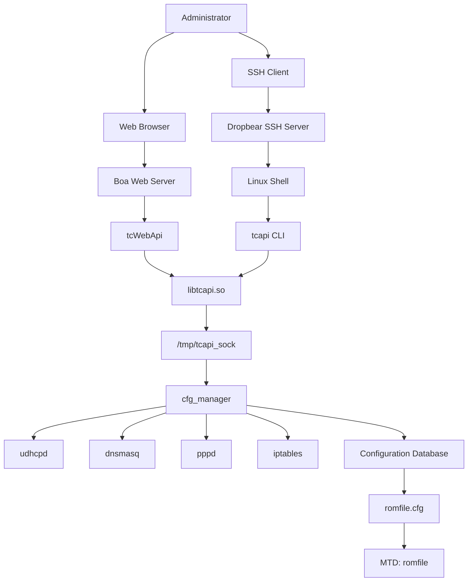

# Service Architecture

## Description

This diagram summarizes the runtime service architecture discovered during the reverse engineering of the ASUS DSL-AC750 firmware.

Both the web interface and the command-line interface ultimately communicate with the `cfg_manager` daemon through `libtcapi.so` and the Unix Domain Socket located at `/tmp/tcapi_sock`.

`cfg_manager` is responsible for coordinating runtime services and managing persistent configuration stored in the `romfile` flash partition.
