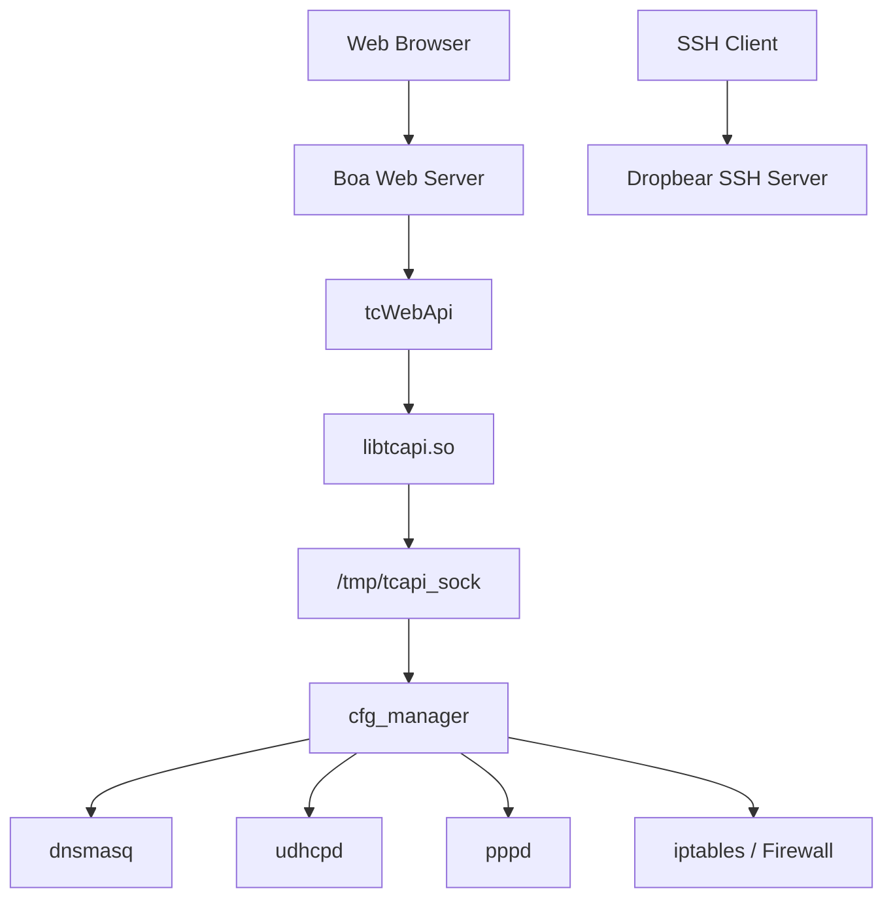

# Service Architecture

## Description

This diagram illustrates the runtime service architecture discovered during the reverse engineering process.

The web interface communicates with `cfg_manager` through `tcWebApi` and `libtcapi.so`. Communication is performed over the Unix Domain Socket located at `/tmp/tcapi_sock`.

`cfg_manager` acts as the central management daemon and coordinates runtime services such as DNS, DHCP, PPPoE, and firewall configuration.
