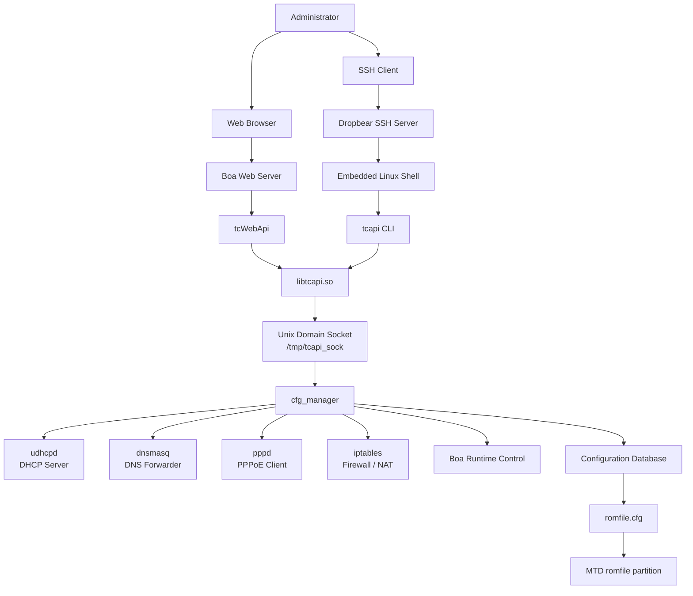

# Service Architecture

## Description

This diagram illustrates the runtime service architecture discovered during the reverse engineering process.

The router exposes two main administrative paths:

- Web-based management through Boa and `tcWebApi`
- Shell-based management through Dropbear SSH and `tcapi`

Both paths eventually use `libtcapi.so` and communicate with `cfg_manager` through the Unix Domain Socket located at `/tmp/tcapi_sock`.

`cfg_manager` acts as the central service orchestration and configuration daemon. It coordinates runtime services such as DHCP, DNS, PPPoE, firewall/NAT, web management, and persistent configuration storage.
