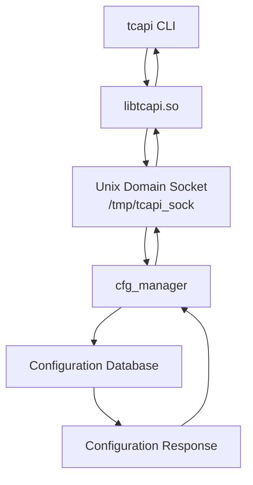

# IPC Analysis

## Overview

This document analyzes the inter-process communication mechanism used by the ASUS DSL-AC750 firmware.

During the reverse engineering process, `tcapi` was identified as the command-line configuration client, while `cfg_manager` was identified as the central configuration daemon.

The goal of this analysis is to understand how `tcapi` communicates with `cfg_manager`.

---

# Research Question

How does `tcapi` communicate with `cfg_manager`?

The investigation revealed that communication is performed through a Unix Domain Socket:

```text
/tmp/tcapi_sock
```

---

# High-Level IPC Flow

```text
tcapi CLI
    │
    ▼
libtcapi.so
    │
    ▼
Unix Domain Socket
/tmp/tcapi_sock
    │
    ▼
cfg_manager
```

---

# Evidence 1: cfg_manager Uses libtcapi

The memory map of the running `cfg_manager` process was inspected using:

```bash
cat /proc/<cfg_manager_pid>/maps | grep tcapi
```

Observed result:

```text
/lib/libtcapi.so.1
```

This confirms that `cfg_manager` loads the `libtcapi` shared library.

---

# Evidence 2: libtcapi Contains IPC-Related Strings

The shared library was inspected using:

```bash
grep -a "socket\|connect\|send\|recv\|/tmp/tcapi_sock" /lib/libtcapi.so.1
```

Observed strings:

```text
send2CfgManager
socket
connect
send
recv
/tmp/tcapi_sock
```

These strings strongly indicate that `libtcapi.so` implements socket-based communication with `cfg_manager`.

---

# Evidence 3: cfg_manager Listens on /tmp/tcapi_sock

The file descriptors of the running `cfg_manager` process were inspected using:

```bash
ls -l /proc/<cfg_manager_pid>/fd
```

Observed result:

```text
3 -> socket:[inode]
```

The socket inode was then matched using:

```bash
netstat -an
```

Observed result:

```text
unix  [ ACC ]  STREAM  LISTENING  /tmp/tcapi_sock
```

This confirms that `cfg_manager` owns and listens on the Unix Domain Socket.

---

# Evidence 4: tcapi Requests Trigger cfg_manager Activity

The process status of `cfg_manager` was inspected before and after running a `tcapi` command.

Before:

```bash
cat /proc/<cfg_manager_pid>/status | grep ctxt
```

Then the following command was executed:

```bash
tcapi get SSH_Entry Enable
```

After the query, the context switch counters increased.

This indicates that the running `cfg_manager` process handled the request.

---

# Runtime Verification

Example query:

```bash
tcapi get SSH_Entry Enable
```

Observed output:

```text
Yes
```

This request was not handled locally by the `tcapi` binary alone. Instead, it was sent to `cfg_manager` through `/tmp/tcapi_sock`.

---

# IPC Architecture



---

# Interpretation

The firmware separates configuration access into three layers:

| Layer | Component | Responsibility |
|------|-----------|----------------|
| Client | tcapi | User-facing configuration command |
| IPC Library | libtcapi.so | Socket communication |
| Server | cfg_manager | Configuration processing and service coordination |

This design allows multiple components, including the web interface and CLI tools, to access the same configuration backend.

---

# Why This Matters

This IPC mechanism explains how different parts of the firmware stay synchronized.

For example:

```text
Web UI
  │
  ▼
tcWebApi
  │
  ▼
libtcapi.so
  │
  ▼
/tmp/tcapi_sock
  │
  ▼
cfg_manager
```

and:

```text
SSH Shell
  │
  ▼
tcapi CLI
  │
  ▼
libtcapi.so
  │
  ▼
/tmp/tcapi_sock
  │
  ▼
cfg_manager
```

Both access paths reach the same configuration daemon.

---

# Key Findings

- `tcapi` is a client, not the configuration database itself.
- `libtcapi.so` implements the communication layer.
- `cfg_manager` listens on `/tmp/tcapi_sock`.
- Communication is performed through a Unix Domain Socket.
- Runtime activity of `cfg_manager` increases when `tcapi` commands are executed.
- The web interface and CLI share the same backend configuration mechanism.

---

# Commands Used

```bash
cat /proc/<cfg_manager_pid>/maps | grep tcapi

grep -a "tcapi_" /lib/libtcapi.so.1

grep -a "socket\|connect\|send\|recv\|/tmp/tcapi_sock" /lib/libtcapi.so.1

ls -l /proc/<cfg_manager_pid>/fd

netstat -an

cat /proc/<cfg_manager_pid>/status | grep ctxt

tcapi get SSH_Entry Enable
```

---

# Conclusion

The ASUS DSL-AC750 firmware uses a Unix Domain Socket based IPC architecture for configuration management.

The `tcapi` command-line utility communicates with `cfg_manager` through `libtcapi.so` and `/tmp/tcapi_sock`.

This confirms that `cfg_manager` acts as the central configuration server, while `tcapi` and the web interface act as clients of the same backend system.
