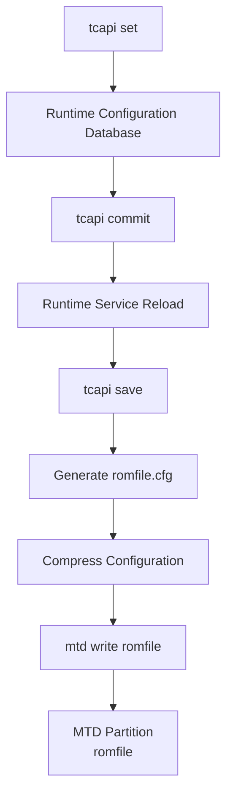

# Configuration Database Analysis

## Overview

This document investigates how the ASUS DSL-AC750 firmware stores, updates, and persists its configuration.

Unlike traditional Linux systems that rely primarily on text-based configuration files, this firmware uses a dedicated configuration framework based on `tcapi` and `cfg_manager`.

The objective of this research is to determine how runtime configuration changes become persistent across reboots.

---

# Research Goal

Determine the complete configuration persistence workflow used by the firmware.

Specifically:

- Where is the running configuration stored?
- What is the role of `tcapi set`?
- What is the role of `tcapi commit`?
- What is the role of `tcapi save`?
- How is the configuration written into flash memory?

---

# Initial Hypothesis

Based on the firmware analysis, the expected workflow was:

```text
tcapi set
      │
      ▼
Runtime Configuration Database
      │
      ▼
tcapi commit
      │
      ▼
Service Reload
      │
      ▼
tcapi save
      │
      ▼
Generate romfile.cfg
      │
      ▼
Write MTD romfile Partition
```

The following experiments were performed to verify this hypothesis.

---

# Runtime Configuration Files

Two different configuration files were identified.

```text
/userfs/romfile.cfg

/tmp/var/romfile.cfg
```

Observed sizes:

| File | Size |
|------|------|
| /userfs/romfile.cfg | 46 KB |
| /tmp/var/romfile.cfg | 56.5 KB |

Observed hashes:

```text
/userfs/romfile.cfg

ef19e52960e273d2c2adc9951240b398
```

```text
/tmp/var/romfile.cfg

d2803280eb025e186d328539b1e3c340
```

The different sizes and hashes indicate that these files serve different purposes.

---

# Flash Storage

The MTD partition table revealed a dedicated partition:

```text
mtd1 "romfile"
```

This strongly suggests that persistent configuration is stored separately from the firmware image.

---

# Experiment 1

## Does `tcapi set` modify romfile.cfg?

The following commands were executed.

```bash
tcapi set Syslog_Entry DisplayLevel 7

md5sum /tmp/var/romfile.cfg
```

Result:

The configuration value changed successfully.

However:

```text
MD5 remained identical.
```

Observed hash:

```text
d2803280eb025e186d328539b1e3c340
```

### Finding

`tcapi set` updates the runtime configuration database only.

It does **not** regenerate `romfile.cfg`.

---

# Experiment 2

## Does `tcapi commit` regenerate romfile.cfg?

The following command was executed.

```bash
tcapi commit Syslog_Entry
```

The file hash was inspected again.

Result:

```text
MD5 remained identical.
```

Additionally, runtime logs indicated that the syslog service restarted.

Observed log:

```text
System log daemon exiting.

syslogd started
```

### Finding

`tcapi commit` applies configuration changes to runtime services.

It does **not** regenerate the persistent configuration file.

---

# Experiment 3

## Does `tcapi save` regenerate romfile.cfg?

The following command was executed.

```bash
tcapi save
```

The hash changed immediately.

Before:

```text
d2803280eb025e186d328539b1e3c340
```

After:

```text
272922c4886192974dc944020f10d101
```

The modification timestamp also changed.

### Finding

`tcapi save` regenerates the runtime configuration file.

---

# Firmware Evidence

The `cfg_manager` binary contains several strings related to configuration persistence.

Observed strings:

```text
/tmp/var/romfile.cfg

/userfs/romfile.cfg

/userfs/bin/mtd write %s romfile

/tmp/var/romfile.cfg.gz

/tmp/var/cfgrestore/%s_romfile.cfg
```

These strings strongly suggest the following workflow.

---

# Configuration Persistence Workflow

```text
tcapi save
      │
      ▼
Generate /tmp/var/romfile.cfg
      │
      ▼
Generate romfile.cfg.gz
      │
      ▼
mtd write romfile
      │
      ▼
MTD Partition "romfile"
```

---

# Interpretation

The firmware separates configuration into two different stages.

## Runtime Configuration

Managed through:

- tcapi
- cfg_manager

Changes exist only in memory.

---

## Persistent Configuration

Generated only during:

```text
tcapi save
```

The generated configuration is then written into the dedicated flash partition.

---

# Configuration Lifecycle



---

# Key Findings

The experiments demonstrate that the firmware uses a multi-stage configuration model.

Observed behavior:

| Operation | Result |
|----------|--------|
| tcapi set | Updates runtime configuration |
| tcapi commit | Applies runtime changes to services |
| tcapi save | Regenerates romfile.cfg |
| mtd write | Persists configuration into flash |

This architecture minimizes flash writes while allowing runtime configuration changes without immediately modifying persistent storage.

---

# Commands Used

```bash
tcapi show Syslog_Entry

tcapi set Syslog_Entry DisplayLevel 7

tcapi commit Syslog_Entry

tcapi save

md5sum /tmp/var/romfile.cfg

ls -lh /tmp/var/romfile.cfg

cat /proc/mtd

grep -a "romfile.cfg" /userfs/bin/cfg_manager
```

---

# Conclusion

The ASUS DSL-AC750 firmware implements a layered configuration management architecture.

Configuration changes are first applied to an in-memory runtime database, then propagated to running services, and finally persisted into flash storage only when an explicit save operation is performed.

This design reduces unnecessary flash wear, separates runtime and persistent configuration, and centralizes configuration management through `cfg_manager`.
