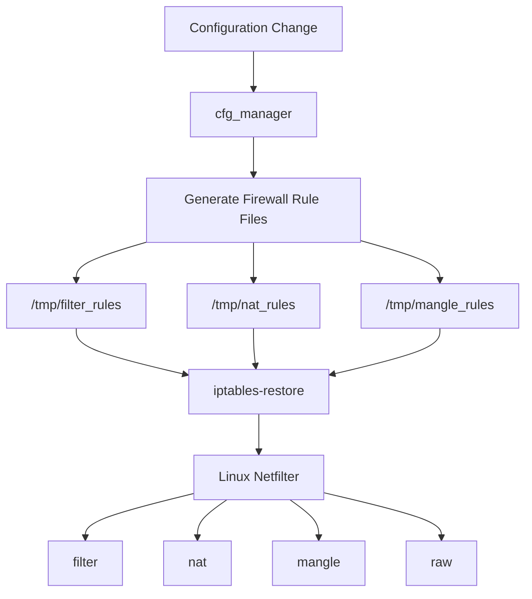

# Firewall Architecture Analysis

## Overview

This document analyzes the firewall implementation used by the ASUS DSL-AC750 firmware.

The objective of this research is to determine how firewall rules are generated, applied, and maintained during runtime.

The analysis combines static firmware inspection with runtime observations from a live system.

---

# Research Goal

Answer the following questions:

- Which component manages firewall rules?
- Does the firmware generate rules dynamically?
- Which Netfilter tables are used?
- How are firewall rules applied to the Linux kernel?

---

# Initial Hypothesis

Previous reverse engineering revealed several firewall-related strings inside `cfg_manager`.

Expected workflow:

```text
Configuration Change
        │
        ▼
cfg_manager
        │
        ▼
Generate Firewall Rules
        │
        ▼
iptables-restore
        │
        ▼
Linux Netfilter
```

---

# Static Firmware Evidence

Inspection of `cfg_manager` revealed numerous firewall-related commands.

Examples:

```text
start_firewall

firewall-restart

/etc/firewall.conf

/tmp/firewall_add_rule.sh

/usr/bin/iptables-save

iptables-restore < /tmp/filter_rules

iptables-restore < /tmp/nat_rules

iptables-restore < /tmp/mangle_rules

iptables -t filter

iptables -t nat

iptables -t raw

iptables -t mangle
```

These strings indicate that firewall rules are generated dynamically and applied using `iptables-restore`.

---

# Firewall Generation

Unlike manually configured Linux firewalls, this firmware appears to generate temporary rule files.

Observed paths:

```text
/tmp/filter_rules

/tmp/nat_rules

/tmp/mangle_rules

/var/tmp/firewall.tmp

/var/tmp/firewall_exe.sh
```

The generated rule sets are then loaded into the kernel.

---

# Runtime Netfilter Tables

The running firewall was inspected directly.

Observed tables:

| Table | Status |
|--------|--------|
| filter | Active |
| nat | Active |
| mangle | Present |
| raw | Present |

---

# Filter Table

The filter table contains the primary packet filtering logic.

Observed chains:

```text
INPUT

FORWARD

OUTPUT

FORWARD_WAN

UPNP

PTCSRVLAN

PTCSRVWAN

webhistory

ACCESS_RESTRICTION

MACS

logaccept

logdrop
```

Important observations:

- Invalid packets are dropped.
- Established connections are accepted.
- LAN traffic is handled separately from WAN traffic.
- Web history filtering is integrated directly into the forwarding path.
- UPnP has its own dedicated chain.

---

# NAT Table

The NAT table manages address translation.

Observed chains:

```text
PREROUTING

POSTROUTING

VSERVER

UPNP

PREROUTING_WAN
```

The running configuration contains the following rule:

```text
MASQUERADE all -- * ppp80
```

This confirms that outbound traffic is translated using source NAT.

---

# Packet Flow

Observed runtime path:

```text
LAN Client
      │
      ▼
br0
      │
      ▼
FORWARD
      │
      ▼
POSTROUTING
      │
      ▼
MASQUERADE
      │
      ▼
ppp80
      │
      ▼
Internet
```

---

# Port Forwarding

The firmware contains dedicated chains for port forwarding.

Observed chains:

```text
VSERVER

PREROUTING_WAN

UPNP
```

This indicates support for:

- Static Port Forwarding
- UPnP Dynamic Rules

---

# DNS Filtering

The OUTPUT chain contains several DNS string matching rules.

Observed examples:

```text
udp dpt:53 STRING match
```

This indicates that the firmware is capable of blocking specific DNS queries before they leave the router.

---

# QoS Support

Although the running mangle table was empty, `cfg_manager` contains:

```text
iptables-restore < /tmp/mangle_rules

start_iQos

start_traditional_qos

start_bandwidth_limiter
```

This strongly suggests that QoS rules are generated dynamically when the feature is enabled.

---

# Runtime Firewall Architecture



---

# Runtime Packet Flow


---

# Key Findings

The investigation demonstrates that the firewall is fully managed by `cfg_manager`.

Observed behavior:

| Component | Responsibility |
|-----------|----------------|
| cfg_manager | Firewall orchestration |
| iptables-restore | Load generated rules |
| filter | Packet filtering |
| nat | Address translation |
| mangle | QoS preparation |
| raw | Optional packet preprocessing |

The firmware does not appear to manipulate individual iptables rules directly.

Instead, complete rule sets are generated and loaded atomically using `iptables-restore`.

---

# Commands Used

```bash
grep -a "iptables" /userfs/bin/cfg_manager

grep -a "firewall" /userfs/bin/cfg_manager

iptables -L -v -n

iptables -t nat -L -v -n

iptables -t mangle -L -v -n

iptables -t raw -L -v -n
```

---

# Conclusion

The ASUS DSL-AC750 firmware implements a centralized firewall architecture managed by `cfg_manager`.

Firewall policies are generated dynamically, written into temporary rule files, and applied atomically using `iptables-restore`.

This design provides a clean separation between configuration management and kernel-level packet filtering while allowing advanced features such as NAT, UPnP, QoS, and web filtering to be integrated into a unified firewall framework.
