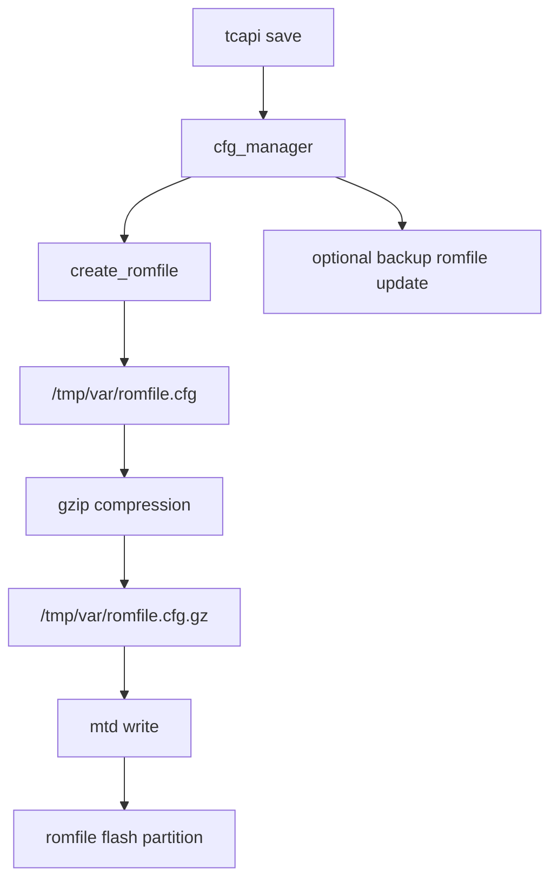

# cfg_manager Binary Analysis

## Overview

This document analyzes the `cfg_manager` binary extracted from the ASUS DSL-AC750 firmware image.

The goal is to validate previous runtime findings using static binary analysis with Ghidra.

---

# Binary Information

The binary was extracted from the firmware SquashFS root filesystem.

Path:

```text
/userfs/bin/cfg_manager
```

File type:

```text
ELF 32-bit MSB executable, MIPS, MIPS32 rel2
```

Properties:

| Property | Value |
|---|---|
| Architecture | MIPS32 |
| Endianness | Big Endian |
| ABI | o32 |
| C Library | uClibc |
| Binary Type | Dynamically linked ELF |
| Symbols | Stripped |
| Entry Point | 0x404200 |

---

# Firmware Extraction

The firmware image was analyzed with `binwalk`.

Important offsets:

```text
0x100      LZMA compressed kernel
0x14E02E   SquashFS root filesystem
```

The root filesystem contained:

```text
/userfs/bin/cfg_manager
/lib/libtcapi.so.1
/userfs/bin/boa
/boaroot/
```

---

# Key Function Identified

Ghidra analysis identified the following important function:

```text
write_cur_romfile_in_flash
```

This function is responsible for writing the current runtime configuration into flash.

---

# Configuration Save Workflow

The decompiled logic shows the following workflow.

```text
create_romfile()
        |
        v
/tmp/var/romfile.cfg
        |
        v
/bin/gzip -c /tmp/var/romfile.cfg > /tmp/var/romfile.cfg.gz
        |
        v
/userfs/bin/mtd ... write /tmp/var/romfile.cfg.gz romfile
        |
        v
Flash partition: romfile
```

---

# Decompiled Logic Summary

The function performs these operations:

1. Removes duplicated nodes from the romfile.
2. Creates `/tmp/var/romfile.cfg`.
3. Validates the generated romfile by loading it with XML parsing routines.
4. Compresses the romfile using gzip.
5. Writes the compressed romfile to flash using `mtd`.
6. Optionally updates the backup romfile.

Observed command construction:

```text
/bin/gzip -c /tmp/var/romfile.cfg > /tmp/var/romfile.cfg.gz
```

Observed flash write command:

```text
/userfs/bin/mtd %s write /tmp/var/romfile.cfg.gz romfile
```

---

# Bitmask Behavior

The function uses a bitmask parameter to decide which actions to perform.

Observed behavior:

| Bit | Meaning |
|---|---|
| `param_2 & 1` | Write running romfile to flash |
| `param_2 & 2` | Update backup romfile |

This explains why the same function can be used in multiple save, restore, and backup scenarios.

---

# Relationship to Runtime Testing

Previous live-device testing showed:

| Operation | Runtime Result |
|---|---|
| `tcapi set` | Runtime value changed |
| `tcapi commit` | Service behavior changed, romfile hash unchanged |
| `tcapi save` | `/tmp/var/romfile.cfg` hash changed |

The binary analysis explains this behavior.

`tcapi commit` applies runtime configuration, while `tcapi save` eventually reaches the romfile persistence path.

---

# Static Evidence

Important strings found in `cfg_manager`:

```text
tcapi_save_req
inner_tcapi_save
create_romfile
write_cur_romfile_in_flash
write_backup_romfile
/tmp/var/romfile.cfg
/tmp/var/romfile.cfg.gz
/userfs/bin/mtd %s write /tmp/var/romfile.cfg.gz romfile
```

These strings align with the decompiled function behavior.

---

# Architecture Interpretation

The configuration persistence architecture can be represented as:



---

# Key Findings

The `cfg_manager` binary is not only a configuration server.

It also performs persistent configuration management by:

- generating romfile data,
- validating romfile structure,
- compressing configuration,
- writing configuration to flash,
- maintaining backup romfile data.

This confirms that `cfg_manager` is a central firmware management daemon.

---

# Conclusion

Ghidra analysis confirms the runtime behavior observed on the live device.

The ASUS DSL-AC750 firmware persists configuration through a dedicated romfile workflow managed by `cfg_manager`.

The most important persistence path is:

```text
tcapi save
    -> cfg_manager
    -> create_romfile
    -> gzip romfile.cfg
    -> mtd write romfile
```

This finding connects the runtime `tcapi` behavior, the firmware binary implementation, and the flash storage layout into a single verified architecture.
